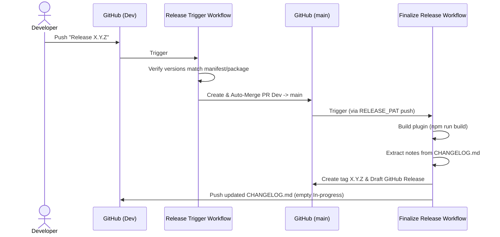

# Releasing the Plugin

This document covers the automated release process using the GitHub Actions release pipeline.

## Branch Strategy

| Branch | Purpose |
|--------|---------|
| `Dev` | Active development — all features and bug fixes go here |
| `main` | Stable release branch — only receives automated merges from `Dev` during a release |

All releases are automated. The pipeline triggers when you commit to `Dev` with a specific commit message.

---

## One-Time Repository Setup

To allow the automated release to run successfully, ensure these settings are configured in your GitHub repository:

### 1. Configure the `RELEASE_PAT` Secret
Because GitHub's default token cannot trigger subsequent workflows (e.g. triggering the finalize build when a PR is merged), we use a Personal Access Token (PAT):
1. Create a Classic PAT under your GitHub account with the **`repo`** and **`workflow`** scopes.
2. In your repo: **Settings → Secrets and variables → Actions → New repository secret**.
3. Name it **`RELEASE_PAT`** and paste the token.

### 2. Enable Pull Request Permissions for Actions
1. In your repo: **Settings → Actions → General → Workflow permissions**.
2. Select **Read and write permissions**.
3. Check the box for **Allow GitHub Actions to create and approve pull requests**.
4. Click **Save**.

---

## Release Process

### Step 1 — Prepare the Release Changes
Ensure all your release changes (such as updates to features, styling, etc.) are committed to `Dev`. Write all your release notes under the `## In-progress` section in [CHANGELOG.md](file:///c:/Users/Asus/Documents/Vaults/plugin_maker/.obsidian/plugins/obsidian-MOC-plugin/CHANGELOG.md).

### Step 2 — Bump the Version
Use npm to bump the version without creating a git tag:
```bash
npm version <patch | minor | major> --no-git-tag-version
```
*(For example, `npm version patch --no-git-tag-version` will automatically bump the patch number and update `manifest.json`, `package.json`, and `versions.json`)*.

> [!IMPORTANT]
> **Criticality of `--no-git-tag-version`**: 
> You **must** include this flag. By default, `npm version` will automatically create a Git commit (with a message of just the version number, e.g., `1.2.3`) and a local Git tag. If it commits automatically, the commit message will **not** have the required `Release ` prefix, causing the automated release pipeline to skip it. Using `--no-git-tag-version` prevents the automatic commit and tag, letting you manually create the `Release X.Y.Z` commit in Step 3.

### Step 3 — Commit and Push
Create a commit on `Dev` with the message prefix `Release ` followed by the new version. This prefix is **strictly required** to trigger the release pipeline.

```bash
git add manifest.json package.json package-lock.json versions.json
git commit -m "Release 1.2.3"
git push origin Dev
```

---

## What Happens Next (Automated)

> [!NOTE]
> **Everything below is automated till draft release.** Once you push your commit with the `Release ` prefix, the rest of the cycle happens without manual intervention.

Once pushed, GitHub Actions handles the rest of the release cycle:



1. **`Release Trigger` Workflow**:
   * Inspects the commit message.
   * Verifies that the version matches the bumped values in `manifest.json` and `package.json`.
   * Automatically creates a PR from `Dev` to `main` and merges it.
2. **`Finalize Release` Workflow**:
   * Runs on the merge to `main`.
   * Sets up Node and runs the production build (`npm run build`).
   * Extracts release notes from `CHANGELOG.md` under `## In-progress`.
   * Pushes the git tag to GitHub.
   * Drafts a GitHub Release and attaches the built release assets (`main.js`, `manifest.json`, and `styles.css`).
   * Rewrites `CHANGELOG.md` to shift notes under `## In-progress` into the new version section, commits the updated file, and pushes it back to `Dev`.

### Step 4 — Publish the Release Draft
Once the workflows complete (usually 1-2 minutes):
1. Go to your repo on GitHub → **Releases**.
2. Find the new draft release.
3. Review the automated release notes, edit if needed, and click **Publish release**.

---

## Files Involved in a Release

| File | Role |
|------|------|
| [manifest.json](file:///c:/Users/Asus/Documents/Vaults/plugin_maker/.obsidian/plugins/obsidian-MOC-plugin/manifest.json) | Plugin metadata; `version` field must match the git tag |
| [versions.json](file:///c:/Users/Asus/Documents/Vaults/plugin_maker/.obsidian/plugins/obsidian-MOC-plugin/versions.json) | Maps each release version to the minimum Obsidian app version |
| [package.json](file:///c:/Users/Asus/Documents/Vaults/plugin_maker/.obsidian/plugins/obsidian-MOC-plugin/package.json) | `version` field kept in sync by `npm version` |
| [version-bump.mjs](file:///c:/Users/Asus/Documents/Vaults/plugin_maker/.obsidian/plugins/obsidian-MOC-plugin/version-bump.mjs) | Script run by `npm version` to update `manifest.json` and `versions.json` |
| [.github/workflows/release-trigger.yml](file:///c:/Users/Asus/Documents/Vaults/plugin_maker/.obsidian/plugins/obsidian-MOC-plugin/.github/workflows/release-trigger.yml) | Automates PR creation and merging from `Dev` to `main` |
| [.github/workflows/release-finalize.yml](file:///c:/Users/Asus/Documents/Vaults/plugin_maker/.obsidian/plugins/obsidian-MOC-plugin/.github/workflows/release-finalize.yml) | Compiles, tags, drafts the release, and prepares `CHANGELOG.md` for next cycle |
| `main.js` | Built plugin bundle — uploaded as release asset |
| `styles.css` | Plugin styles — uploaded as release asset |
